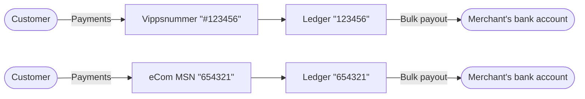
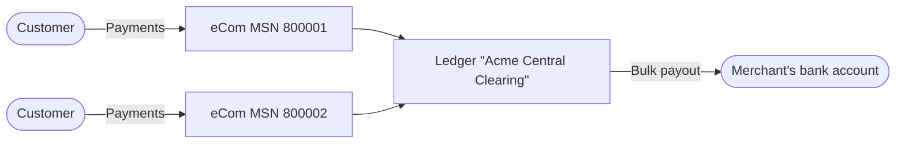

# API guide

 *Version 1 is deprecated. Version 2 is expected in October 2023.*

 *Available for MobilePay in selected markets at the [Vipps MobilePay joint platform launch](https://www.vippsmobilepay.com/#about).*

**Please note:**
The Report API is primarily for accounting partners who will use the API to integrate
with their accounting systems, allowing them to provide the accounting information to their merchants.
Accounting partners use their
[accounting keys](https://developer.vippsmobilepay.com/docs/partner/partner-keys/),
and are not allowed to use the merchant's own API keys.
Merchants can then simply
[give access to the accounting partner](#give-access-to-an-accounting-partner),
without doing any development themselves.

The Report API provides accounting partners you with information about their merchant's payments.
It's used to aggregate information across the API platform, and it can contain data for many
payments at once.

**Please note:** The information fetched from the Report API is
asynchronous and trailing behind the other APIs. It is usually behind
by a second or so, but if there are operational problems, it could, in the worst
case, be behind by several hours. Therefore, you should always use other
Vipps MobilePay APIs as the source of truth for the status of an operation.

## Overview of the settlement process

Merchants using Vipps MobilePay receive the money for their sales in bulk bank transfers (settlements),
usually one per day. It is therefore necessary to download
a specification reports that explains the bulk bank transfer, so it can be correctly filed in the
merchant's accounting system. Such reports can be fetched either
in the [merchant portal](https://portal.vipps.no) or by using this API.

Usually, you will wish to implement a *reconciliation process*, where
you download a report from Vipps MobilePay each day, and check that contents
of the report match the data you have on your own side.
We recommended that you do this by matching per transaction on transaction IDs.

This guide will focus on using this API, but may also be useful reading
for those who rely on using reports from the portal for their reconciliation
processes.

The exact details of the settlement process (e.g., the delay before the money
is received) is subject to the agreement between the merchant and Vipps MobilePay.
Please see the general [Vipps MobilePay Settlements description](https://developer.vippsmobilepay.com/docs/settlements)
for more information.

### Ledger transactions and balances

We don't transfer money to/from the merchant for every payment made.
Instead, all transactions are put on a *ledger*
that tracks the funds that we owe the merchant. During the day, transactions
occur that usually increase, and sometimes decrease, the balance the merchant
has in Vipps MobilePay. Periodically (daily/weekly/monthly depending on configuration), the
balance of the ledger is paid out to a configured account number and the balance
is reset.

The following illustration shows an example day at a low-traffic merchant.
*Captures* (sales) and *refunds* are added to the
ledger, changing the balance of funds that Vipps MobilePay owes the merchant.
At the end of the day, we deduct some fees and the remaining balance
is paid out. The payout is itself an entry on the ledger,
adjusting the balance down to zero.


This example may look as follows if the data returned from
[`GET:/report/v2/ledgers/12345/funds/dates/2022-10-01`][fetch-report-by-date-endpoint] is displayed
as a table:

| ledgerDate | entryType            |  amount | reference                          | pspReference               | recipientHandle | time                            | balanceBefore | balanceAfter |
|------------|----------------------|--------:|------------------------------------|----------------------------|-----------------|---------------------------------|--------------:|-------------:|
| 2022-10-01 | capture              |  10000 | purchase-12                        | 3343121302                 | NO:57860        | 2022-10-01T16:33:00.824993+0200 |             0 |        10000 |
| 2022-10-01 | capture              |  10000 | purchase-12                        | 3334234112                 | NO:57860        | 2022-10-01T18:37:55.982497+0200 |         10000 |        20000 |
| 2022-10-01 | capture              |  20000 | purchase-14                        | 3259823497                 | NO:57860        | 2022-10-01T19:12:54.932428+0200 |         20000 |        40000 |
| 2022-10-01 | refund               | -10000 | purchase-12                        | 1154320987                 | NO:57860        | 2022-10-01T23:47:59.984224+0200 |         40000 |        30000 |
| 2022-10-01 | fees-retained        |  -1200 |                                    | 01H7W7Q6Y5R-3G58CTAZX0MHKV2 |                 | 2022-10-02T00:00:00.000000+0200 |         30000 |        28800 |
| 2022-10-01 | scheduled-for-payout | -28800 | Vipps utbet. 2000023 Vippsnr 57860 | 2000023                    |                 | 2022-10-02T00:00:00.000000+0200 |         28800 |            0 |


Where the data is of these types:

* `ledgerDate` - Date for which the transactions occurred, in YYYY-MM-DD format.
* `entryType` -  The type of transaction. See [Entry type reference](#entry-type-reference) for a description.
* `amount`- Amounts are specified in minor units. For Norwegian kroner (NOK) that means 1 kr = 100 øre. Example: 499 kr = 49900 øre.
* `reference` - The unique ID provided by the merchant (or partner) when initiating the payment. This corresponds to the `reference` provided with the ePayment API request (this is called `orderId` in the older eCom API).
* `pspReference` - This reference is automatically generated by Vipps MobilePay.
* `recipientHandle` - Identification of the sales unit that this payment was made to/from. Contains a country code and ID, separated by a colon (':').
* `time` - The date and time of the transaction. These are presented together with an offset (difference from UTC time in hours).
* `balanceBefore` - Amounts are specified in minor units. For Norwegian kroner (NOK) that means 1 kr = 100 øre. Example: 499 kr = 49900 øre.
* `balanceAfter` - Amounts are specified in minor units. For Norwegian kroner (NOK) that means 1 kr = 100 øre. Example: 499 kr = 49900 øre.


Please note that monetary values are returned from the endpoint in cents/øre.
This example shows:

* Three sales captures minus one refund brings the daily total to 300.00.
* The sum of fees for the captures, 12.00, is retained by Vipps MobilePay.
* The remaining balance of 288.00 being *scheduled* for payout. The actual payout
  may not happen after waiting some days, reflecting delays in the bank networks, and
  subject to the merchant's agreement with Vipps MobilePay. Once the payout is scheduled,
  the money is gone from the ledger balance.

Above, only the total fees for the settlement period are included.
If you require further specification of the fees charged, these are available from
the [`GET:/report/v2/ledgers/{ledgerId}/{topic}/dates/{ledgerDate}`][fetch-report-by-date-endpoint] endpoint,
where `{topic}` is `fees`.

Continuing on the example above, this may be the result of a call to
`GET:/report/v2/ledgers/12345/fees/dates/2022-10-01`:

| ledgerDate | entryType            | amount | reference                   | pspReference               | recipientHandle | time                            | balanceBefore | balanceAfter |
|------------|----------------------|-------:|-----------------------------|----------------------------|-----------------|---------------------------------|--------------:|-------------:|
| 2022-10-01 | capture-fee          |   -400 | purchase-12                 | 3343121302                 | NO:57860        | 2022-10-01T16:33:00.824993+0200 |             0 |         -400 |
| 2022-10-01 | capture-fee          |   -400 | purchase-12                 | 3334234112                 | NO:57860        | 2022-10-01T18:37:55.982497+0200 |          -400 |         -800 |
| 2022-10-01 | capture-fee          |   -400 | purchase-14                 | 3259823497                 | NO:57860        | 2022-10-01T19:12:54.932428+0200 |          -800 |        -1200 |
| 2022-10-01 | fees-retained        |   1200 | 01H7W7Q6Y5R3G58CTAZX0MHKV2  | 01H7W7Q6Y5R3G58CTAZX0MHKV2 |                 | 2022-10-02T00:00:00.000000+0200 |          1200 |            0 |

Note that:

* `pspReference` can be used to correlate between `funds` and `fees`.
  * Note that, while each `capture` shown for the topic of `funds` has a unique `pspReference`, it is possible
    to have *several* fees on `fees` related to the same `pspReference`.
* The `fees-retained` entry will always appear at the same time on both endpoints and have opposing
  signs (money is moved from the `funds` account and put on the `fees` account).

**Please note:** In general, for both `fees` and `funds`, it is important to
be prepared for new entry types. The reference of entry types is at the bottom
of this page, *but new types can be added to the API later without prior warning*.

### Complicating factors and account diagram

While the above is a sufficient example of the "happy day" settlement process,
there are some possible complicating factors.

#### Net vs gross settlements

Fees for the services from Vipps MobilePay can be charged in two ways:

* Net settlements - The fees are retained from the settlement
  payouts. The `fees-retained` entry is used to settle the fees, as shown
  in the example above.
* Gross settlements - The fees are invoiced. In this case, there
  is no mention of the fees in the *funds* account, while on the *fees* account,
  a `fees-invoiced` entry indicates that an invoice has been sent for the fees.

#### Payout delay

Settlement payouts are not done instantly, but after a certain
delay. The length of this delay varies depending on the agreement between the merchant
and Vipps MobilePay. For instance, if it is agreed to pay out money at "T+2",
then assuming the capture/sale is done on Monday, the money is paid to the merchant
on Wednesday. However, the report about what payout is planned on Wednesday
is available already Tuesday morning. This is indicated by `scheduled-for-payout`
in the example above.

#### Negative balance

If the sum of refunds and fees are larger than the sum of captures,
the balance of the ledger can be become negative. For example, consider
a concert that sells tickets months in advance, and that this money
is continuously paid out on a daily basis. Then, if the concert is cancelled
and all tickets refunded, all of that money is refunded at once, likely
leading to a negative balance.

If a balance is negative for too long, an invoice will be sent to the merchant.
This will lead to a `top-up` entry on the *funds* ledger (either when the invoice
is sent or when it is paid; details may vary).

#### Account diagram

To correctly model these complicating factors, we can use the following account diagram:


Note that:

* When sales (captures) happen, the balance of *funds* account is increased.
  Refunds decrease the balance of the *funds* account.
* As fees are charged throughout the day, they are deducted from the *fees* account.
* Fees are *settled* in one of two ways:
  * i) They are transferred from the *funds* account to the *fees* account, or
  * ii) They are invoiced from the merchant
* Periodically, the *funds* account is packaged/batched and scheduled for payout.
  This is indicated in the figure with a transfer to the *payouts* account,
  where money is waiting to be paid out.
  * If there are any problems with paying the money out (such as, the bank account
    of the merchant was closed), the money will stay in the *payouts* account.
    In particular, the *funds* account will contain `scheduled-for-payout`
    even if the actual payout did not succeed. If money does not arrive within
    the agreed-upon delay, please contact customer service.
  
The topics available at the
[`GET:/report/v2/ledgers/{ledgerId}/{topic}/dates/{ledgerDate}`][fetch-report-by-date-endpoint]
 are described further:

* The `funds` topic reports on the *funds* account.
* The `fees` topic reports on the *fees* account.
* There is currently no endpoint to report on *payouts*, but we hope to add
  this in the future.

We recommend that the merchant's accounting system reflects the structure above:

* An account for fees owed to Vipps MobilePay.
* An account for funds stored at Vipps MobilePay.
  * When sales are made, book the income towards this account.
* A settlement payout from Vipps MobilePay is simply a transfer between
  two funds accounts, both belonging to the merchant.

## Downloading reports

### Retrieving the LedgerId

In order to call the endpoints containing settlement information, you will
need a *LedgerId*. A *ledger* is an *instance* of the set of accounts described
in the [Account diagram](#account-diagram).
The ledger determines which payments are grouped together for settlement.

For the large majority of merchants, there is a direct correspondence
between a Vippsnummer or eCom Merchant Serial Number (MSNs) to a ledger:



However, for merchants who require it, Vipps MobilePay has
limited support for multiple Vippsnummer and eCom MSNs to be settled together.
The payments to multiple different units are then combined in a
single settlement payout:



The ledger has its own `ledgerId`, so the first step in using this API is
to fetch the list of ledgers you have access to. If you are integrating a single
merchant it may be enough to hit [this endpoint][get-ledgers-endpoint] once manually to identify
the `ledgerId`. An example response from
[`GET:/settlement/v1/ledgers`][get-ledgers-endpoint]
is:

```json
{
  "items": [
    {
      "ledgerId": "302321",
      "currency": "NOK",
      "payoutBankAccount": {
        "scheme": "BBAN:NO",
        "id": "86011117947"
      },
      "firstPayout": "2000001",
      "lastPayout": "2000045",
      "owner": {
        "scheme": "business:NO:ORG",
        "id": "987654321"
      },
      "settlesForRecipientHandles": [ "api:123455" ]
    }
  ],
  "cursor": ""
}
```

A Vippsnummer will use the same `settlesForRecipientHandles` structure, but have a different prefix:

```json
{
  "settlesForRecipientHandles": [ "NO:123455" ]
}
```

Similarly, a MyShop instance will have a handle `DK:123456` (Denmark) or `FI:123456` (Finland).

If you only want to look up the `ledgerId` from an MSN or Vippsnummer, you
may use the `settlesForRecipientHandles` argument:

```sh
GET:/settlement/v1/ledgers?settlesForRecipientHandles=DK:123456
```

If you are integrating an accounting system for many customers, it can be
relevant to poll [this endpoint][get-ledgers-endpoint] many times as you will continue to see new
ledgers appear for different customers as they
[grant your accounting system access to their data](overview.md#give-access-to-an-accounting-partner).

### Paging and cursors

The
[`GET:/report/v2/ledgers/{ledgerId}/{topic}/dates/{ledgerDate}`][fetch-report-by-date-endpoint]
endpoint has a response in this form:

```json
{
  "cursor": "34rqweweca32r=a+",
  "items": [{}, {}]
}
```

There will be up to 1000 items returned in each request. After storing or processing
the `items`, a new request should be done where the value from `cursor` is passed
in order to continue on the next *page* of data. Once an empty string `""` is returned
as the cursor, the end of the report has been reached.

### Retries of downloads and polling for new data

We recommend that users of this API implement a robust
retry mechanism. Sometimes reports can be delayed, or there can be network issues
or temporary downtime either at the integrator or at Vipps MobilePay. Rather
than, e.g., scheduling a job to run at 08:00 every morning, we instead recommend
a pattern where a job is run *once every hour of every day*. The job should
then be programmed to download whatever data is available which has not yet
been fetched. This pattern gracefully handles temporary downtime and delays.

If you set up a job every hour, please pick
a random minute during the hour when your job runs.
If one integrator runs
their jobs at :14 after each hour and another at :48, they don't have to
compete for resources from this API, and both get a better experience
than if they both started their job on :00.
Don't choose to run your time between :00 and :10, as that time integrators
who did not read this paragraph will use the API.

### Immutability of data

Regardless of which kind of report is fetched, once data is available and has
been returned it will be
*immutable*. The same report fetched at a later point will always contain the
same data. If something needs to be corrected, this will be done by adding new
correction entries, leaving the old incorrect entries unmodified.

Note however that through upgrades to the API, more types of data (more columns/JSON fields)
may become available in historical reports.

### Reporting periods

The synchronization process can happen in several ways, as visualized in the following
diagram:


#### Method 1: Fetching a complete report for each date

The
[`GET:/report/v2/ledgers/{ledgerId}/{topic}/dates/{ledgerDate}`][fetch-report-by-date-endpoint]
endpoint offers a complete report per *ledger date*; indicated by blue in the diagram
above. Normally, a ledger date
lasts from midnight to midnight in the timezone of the merchant, but it
can be configured to other cutoffs such as 04:00 to 04:00.

On this endpoint, no data is available until the entire ledger date is complete.
Your code should be written to periodically poll for a report for the next
date you don't already have one. You will then initially receive a response
indicating that the report is not yet ready.

Here is an example call:

```sh
GET:/report/v2/ledgers/{ledgerId}/funds/dates/2023-08-02
```

Response:

```json
{
  "cursor": "",
  "items": [],
  "tryLater": true
}
```

Eventually when the report is ready, you will receive a response with data,
such as:

```json
{
  "cursor": "Mw==",
  "items": [
    {
      "pspReference": "22342342342",
      "time": "2023-09-27T14:11:12.640000Z",
      "entryType": "capture",
      "reference": "order-123",
      "currency": "NOK",
      "amount": 10000,
      "recipientHandle": "NO:12345",
      "balanceAfter": 10000,
      "balanceBefore": 0
    },
    {
      "pspReference": "22342342342",
      "time": "2023-09-27T14:11:12.640000Z",
      "entryType": "refund",
      "reference": "order-123",
      "currency": "NOK",
      "amount": 20000,
      "recipientHandle": "NO:12345",
      "balanceAfter": 30000,
      "balanceBefore": 10000
    }
  ],
  "tryLater": false,
}
```

**Please note**: In this example, `"cursor"` is not an empty string but contains a value.
This indicates that the provided `items` is not the full list of data, and that you need
to do another call to continue fetching more data. See the section on [paging and cursors](#paging-and-cursors).

In the most typical scenario, the balance is zero at the start of a day, funds
are accumulated, and the day ends with a `scheduled-for-payout` entry that
pays out the balance and adjusts the balance back down to zero.
There are however other cases:

* If a weekly/monthly settlement has been configured, then the balance will keep
  accumulating from day to day until the payout is scheduled on the last day of
  the week/month.
* If the balance is negative (the sum of refunds and fees is higher than
  the sum of captures), a negative balances is carried over to the next day.
* The agreement with Vipps MobilePay may stipulate that a certain balance is always
  kept in the ledger to cover possible refunds (so-called "rolling reserve").

By fetching daily reports, you will always get more data every day, even
if payouts are scheduled on a weekly/monthly basis, or if the balance is negative.
The `balanceAfter` field represents the balance the merchant owns that is sitting
at Vipps MobilePay at any time.

#### Method 2: Continuous feed of data

The other option is to continuously stream data as it becomes available.
You would normally use this to synchronize the data from Vipps MobilePay to your
own database, and then it is your own responsibility to do any periodization,
if desired.
We recommend this way of fetching data in general. Just be aware that it
may require some more sophistication in the logic for fetching reports.

The [`GET:/report/v2/ledgers/{ledgerId}/{topic}/feed`][fetch-report-by-feed-endpoint]
endpoint indicates single "infinite" report, the "feed":

```sh
GET:/report/v2/ledgers/{ledgerId}/funds/feed
```

The big difference from the other access methods is that the `cursor`
*will never become empty*. Once you have read to the end of the feed
and there will be no more data available, you will receive:
1) the same cursor over again
2) the `tryLater` field will be set to `true`

It may or may not be that the `items` list is empty when hitting the
end of the feed in this manner. If you get a response where `tryLater` is true,
please wait some time (seconds or minutes
or hours depending on your traffic level) and then retry using the same cursor.
If `tryLater` is false more data is immediately available if you pass in the provided
cursor.

If you poll the endpoint too often, and unless you represent a very high volume
merchant, you will end up downloading either 0 or 1 entries
each time you call the endpoint, effectively downloading the entries one by one.
This is inefficient for both you and Vipps MobilePay; so, unless you need the data
with low latency, we recommend just downloading new data relatively seldom
(e.g. once per minute or once per hour).

#### A report for each payout?

What about a specification for the payout to the bank account of the merchant?

We don't recommend relying on such a report because it will lead to
sudden "radio silence" if there is negative balance for an extended period of time.
However, if you need such a specification anyway, it is easy enough to
do yourself using the
[`GET:/report/v2/ledgers/{ledgerId}/{topic}/dates/{ledgerDate}`][fetch-report-by-date-endpoint]
endpoint.

Each payout (settlement bank transfer) will always consist of a whole number
of ledger dates. And, the `scheduled-for-payout` entry will always be the last
entry on the ledger date, *if* a payout is made. So:

* Look up the last date for which you do not have a report
* Fetch data for that date from
  [`GET:/report/v2/ledgers/{ledgerId}/{topic}/dates/{ledgerDate}`][fetch-report-by-date-endpoint], where `{topic}` is `funds`.
* Does the funds report for that date end with a `scheduled-for-payout` entry?
  * If yes, stop.
  * If no, no payout was made at the end of the day (e.g., negative balance, weekly/monthly settlement, etc.)
    Proceed to the next date and include this in the *same* report.

Using the example figure above, these steps will produce:

* Report for payout 2000101:
  * `.../dates/2022-09-01/funds`
* Report for payout 2000102:
  * `.../dates/2022-09-02/funds`
  * `.../dates/2022-09-03/funds`

## Entry type reference

Users of this API must account for the possibility of
more entry types being added in the future. Such new entry types will not cause
upgrade of the API version.

**Please note:**
You should be prepared to receive a new entry type that you do not
already know about. The introduction of a new
entry type will not be considered an API change.
The important thing is always the contribution that the amount makes to the
balance of a given fees or funds account.

### Funds entry types

The following are entry types returned for the `funds` ledgers:

* [capture](#capture)
* [refund](#refund)
* [fees-retained](#fees-retained)
* [scheduled-for-payout](#scheduled-for-payout)
* [payout-aborted](#payout-aborted)
* [retained-disputed-capture](#retained-disputed-capture)
* [returned-disputed-capture](#returned-disputed-capture)
* [correction](#correction)
* [top-up](#top-up)

#### capture

Captures represent money being transferred from the customer,
through Vipps MobilePay, to the merchant. Captures increase the ledger balance in the *funds* account.

In some other APIs, we distinguish between two
types of payment flows: The *sale* flow for an immediate purchase,
and the *reserve/capture* flow for cases when one first receives a reservation,
and then captures it fully or partially at a later point. For *funds* ledgers,
both of these are denoted with an entry type of `capture`.

#### refund

Refunds represent transfers from the *funds* account back to the customer. These are
initiated by the merchant, either by using the API or
through the [merchant portal](https://portal.vipps.no). Refunds are always deducted
from the next settlement payout, even if you have a gross settlement setup.
Currently, refunds always have zero fees.

#### fees-retained

Entry type of `fees-retained` indicates that money was retained to cover fees to Vipps MobilePay (i.e., *net settlements*).
This entry type is present in both the *funds* reports (as a negative value) and the *fees* report (as a positive value).

#### scheduled-for-payout

Entry type of `scheduled-for-payout` indicates that a payout has been scheduled from the ledger.
This is described under [Payout delay](#payout-delay).

#### payout-aborted

Entry type of `payout-aborted` indicates that a payout was aborted, and the money put back on the ledger.
This can happen in some extraordinary circumstances if a payout can never
be executed (despite retries), or the payout is aborted in order to cover
a negative balance on the subsequent day.

#### retained-disputed-capture

If a capture (sale) that has been previously added to the ledger
is *disputed* by the issuer (e.g., suspicion of fraud, damaged goods),
Vipps MobilePay may deduct the capture from the ledger.

The `reference` has the same value as the corresponding capture.

#### returned-disputed-capture

In the event that the merchant wins the dispute process, money previously captured is returned.
The retained/returned cycle may in theory occur several times for the same capture.

The `reference` has the same value as the corresponding capture.

#### correction

A `correction` entry type indicates a fully manual adjustment of the balance
to resolve some unexpected problem. Normally, you should expect to have received
communication about the nature of the incident if this is ever
present. Feel free to contact Vipps MobilePay support for further details
if you see this and don't know why.

#### top-up

This represents a deposit ("top-up") of the account, by the merchant directly transferring
funds to it. For instance, if the merchant's balance on the ledger is negative
for a while, an invoice can be sent prompting the merchant to pay money to
Vipps MobilePay (i.e., topping up their account so that the balance becomes positive).

### Fees entry types

The following are entry types returned for the fees ledgers:

* [capture-fee](#capture-fee)
* [fees-retained](#fees-retained-1)
* [fees-invoiced](#fees-invoiced)

#### capture-fee

A fee charged for a capture.

#### fees-retained

Indicates that money was retained to cover fees to Vipps MobilePay ("net settlements").
This entry type is present *both* on the funds reports (negative) and the fees report (positive).

#### fees-invoiced

If *gross/non-retained settlements* has been configured, then the fees
are invoiced on a monthly basis, and the fees balance is adjusted
using this entry type.

## Further reading

See:

* [Authenticating to the Report API](overview.md)
* [Errors](errors.md)


[get-ledgers-endpoint]:https://developer.vippsmobilepay.com/api/report/#tag/settlementv1/operation/getLedgers
[fetch-report-by-date-endpoint]:https://developer.vippsmobilepay.com/api/report/#tag/reportv2ledgers/paths/~1report~1v2~1ledgers~1%7BledgerId%7D~1%7Btopic%7D~1dates~1%7BledgerDate%7D/get
[fetch-report-by-feed-endpoint]:https://developer.vippsmobilepay.com/api/report/#tag/reportv2ledgers/paths/~1report~1v2~1ledgers~1%7BledgerId%7D~1%7Btopic%7D~1feed/get
