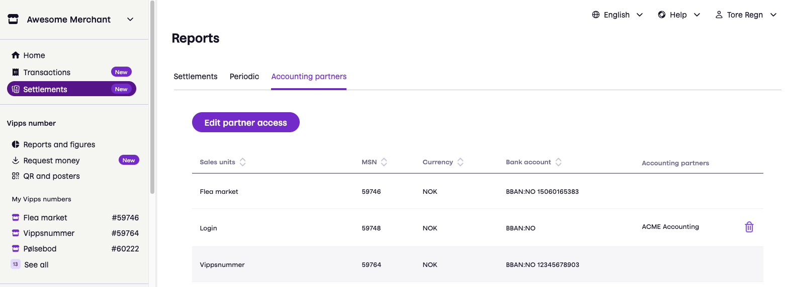
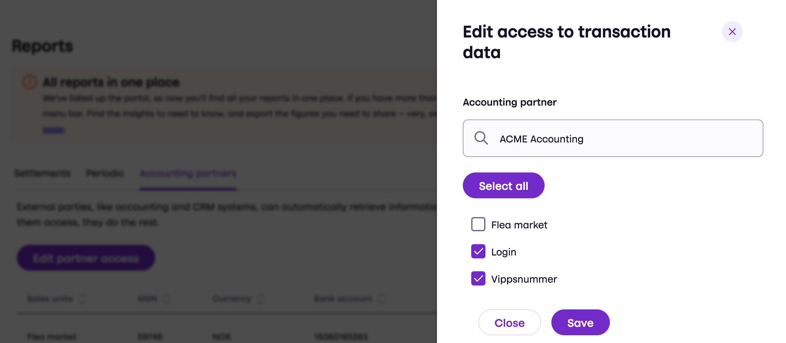

# Authenticating to the Report API

 *Version 2 is available now. Version 1 is deprecated.*

 *Available for MobilePay in selected markets at the [Vipps MobilePay joint platform launch](https://www.vippsmobilepay.com/about).*

**Please note:**
The Report API is primarily for accounting partners who will use the API to integrate
with their accounting systems, allowing them to provide the accounting information to their merchants.
* Accounting partners use their
 [accounting keys](https://developer.vippsmobilepay.com/docs/partner/partner-keys/),
 and are not allowed to use the merchant's own API keys.
* Merchants can then simply
 [give access to the accounting partner](#give-access-to-an-accounting-partner),
 without doing any development themselves.

## Partners with accounting keys

See:
[Access token API: Partner authorization](https://developer.vippsmobilepay.com/docs/APIs/access-token-api/#partner-authorization).

## Sales units that have API access

The Report API is available for sales units that have access to the Vipps MobilePay API platform.
Access to the Report API is provided through the merchant's API keys for the sales unit,
which grant access to that single Merchant Serial Number (MSN).

**Important:** Merchants are not allowed to share API keys with partners that have not been approved by
Vipps MobilePay, as we are strictly regulated and must know who can make payments using our APIs.
When a merchant shares its API keys, we have no way of knowing who makes the API requests.
This is why we require that all API requests made by a partner on behalf of a
merchant are done using the partner's own API keys (the accounting keys).

If the merchant uses an integration partner (see
[partner types](https://developer.vippsmobilepay.com/docs/partner#partner-types)),
it is the same as using the merchant's own API keys.

If you are new to the platform, see
[Getting started](https://developer.vippsmobilepay.com/docs/getting-started).

## Sales units that do not have API access

It is not possible for merchants to use the Report API directly with Vippsnummer sales units,
since the sales unit doesn't have API access.

Although Vippsnummer sales units don't have API access, they can designate an accounting partner that does.
Their accounting partner can then use the Report API to provide them with their accounting information.

There are reports available on
[portal.vipps.no](https://portal.vipps.no).

### Give access to an accounting partner

**Important:** Merchants are not allowed to share API keys with partners that have not been approved by
Vipps MobilePay, as we are strictly regulated and must know who can make payments using our APIs.
When a merchant shares its API keys, we have no way of knowing who makes the API requests.
This is why we require that all API requests made by a partner on behalf of a
merchant are done using the partner's own API keys (the accounting keys).

The merchant portal shows the accounting partner(s) for each sales unit.
A merchant can have any number accounting partners, and it's possible to have multiple accounting partners for each sales unit.

Merchants must specify which ledgers the accounting partner will have access to on
[portal.vipps.no](https://portal.vipps.no)
as described here:
[Give access to an accounting partner](https://developer.vippsmobilepay.com/docs/APIs/report-api/api-guide/overview/#give-access-to-an-accounting-partner).

Accounting partners must use their
[accounting keys](https://developer.vippsmobilepay.com/docs/partner/partner-keys/#types-of-partner-keys).

Accounting companies can use the
[form on vipps.no](https://www.vipps.no/developer/become-a-partner/)
to become an accounting partner.

