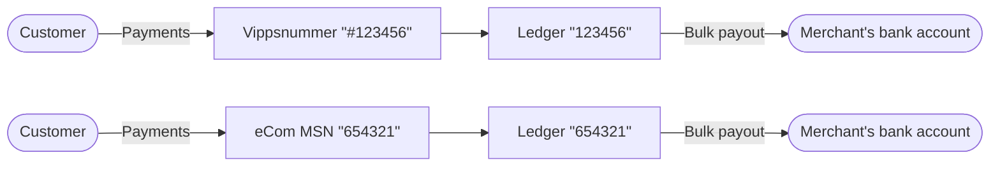
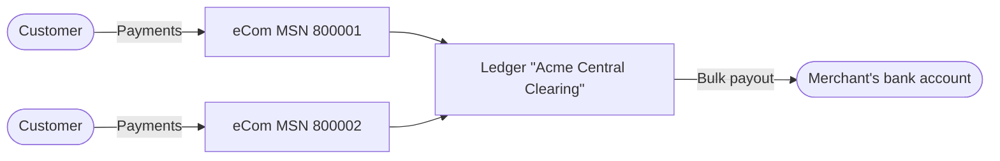

<!-- START_METADATA
---
title: Settlements
sidebar_position: 32
pagination_prev: Null
pagination_next: Null
---
END_METADATA -->

# Settlements

<!-- START_COMMENT -->

ℹ️ Please use the website:
[Vipps MobilePay Technical Documentation](https://developer.vippsmobilepay.com/docs/APIs/report-api).

## Table of contents

* [Overview](#overview)
* [Ledgers](#ledgers)
* [Transaction types](#transaction-types)
  * [Capture transactions](#capture-transactions)
  * [Refund transactions](#refund-transactions)
  * [Payout transactions](#payout-transactions)
  * [Other transactions](#other-transactions)
* [Reports](#reports)
  * [Periodization](#periodization)

<!-- END_COMMENT -->

## Overview

Merchants using Vipps will receive the money in bulk payments, usually one per
day. In these, bulk payment we have summed together all payments for the day,
subtracting refunds and fees to Vipps. It is therefore necessary to download
reports that explain the bulk payment, so that it can be correctly filed in the
merchant's accounting system. Such reports can be fetched either
in [the portal](https://portal.vipps.no) or by using the Report API.

Usually, you will wish to implement a *reconciliation process*, where
you download a report from Vipps each day, and check that contents
of the report match the data you have on your own side.
We recommended that you do this by matching per transaction on transaction IDs.

This guide will focus on using the Report API, but may also be useful reading
for those who rely on using reports from the portal for their reconciliation
processes.

See
[Common topics: Settlements](https://developer.vippsmobilepay.com/docs/vipps-developers/settlements)
for details about settlements, in general.

## Ledgers

Vipps settlements work in the same way for all Vipps payment products; whether
one is using
[Vippsnummer](https://vipps.no/produkter-og-tjenester/bedrift/ta-betalt-i-butikk/ta-betalt-med-vipps/#kom-i-gang)
or one of the Vipps APIs.

Vipps does not transfer money to/from the merchant for every payment made.
Instead, all transactions are put on a *ledger*
that track the funds that Vipps owes the merchant. During the day transactions
occur that usually increase, and sometimes decrease, the balance the merchant
has in Vipps and thus the *ledger balance*. Periodically, usually daily, the
balance of the ledger is paid out to a configured account number and the balance
is reset.

The following illustration shows an example day at a low-traffic merchant.
*Captures* and *refunds* (described in further detail below) are added to the
ledger, changing the balance of funds that Vipps owes the merchant. In the end,
the balance is paid out. The payout is itself a transaction on the ledger,
adjusting the balance down to zero.


For the large majority of merchants, there is a direct correspondence between a
Vippsnummer or e-com Merchant Serial Number (MSNs) to a ledger:



However, for merchants who require it, Vipps has
limited support for multiple Vippsnummer and eCom MSNs to be settled together.
The payments to multiple different units are then combined in a
single settlement payout:



The ledger has its own `ledgerId`, so the first step in using the report API is
to fetch the list of ledgers you have access to. If you are integrating a single
merchant it may be enough to hit this endpoint once manually to identify
the `ledgerId`. An example response from
[`GET:/settlement/v1/ledgers`](https://developer.vippsmobilepay.com/api/report#/paths/~1settlement~1v1~1ledgers/get)
is:

```json
{
  "items": [
    {
      "ledgerId": "302321",
      "currency": "NOK",
      "payoutBankAccount": {
        "scheme": "BBAN:NO",
        "id": "86011117947"
      },
      "firstPayout": "2000001",
      "lastPayout": "2000045",
      "owner": {
        "scheme": "business:NO:ORG",
        "id": "987654321"
      },
      "settlesForRecipientHandles": [ "api:123455" ]
    }
  ],
  "cursor": ""
}
```

A Vippsnummer will use the same `settlesForRecipientHandles` structure, but have a different prefix:

```json
{
  "settlesForRecipientHandles": [ "NO:123455" ]
}
```

If you only want to look up the `ledgerId` from an MSN or Vippsnummer, you
may use the `settlesForRecipientHandles` argument to filter the response.

If you are integrating an accounting system for many customers, it can be
relevant to poll this endpoint many times as you will continue to see new
ledgers appear for different customers as they
[grant your accounting system access to their data](overview.md#give-access-to-an-accounting-partner).

## Transaction types

### Capture transactions

Captures represent money being transferred from the customer,
through Vipps, to the merchant. Captures increase the ledger balance. The
captures are indicated by a gross amount and a fee to Vipps for the service
provided; the balance is typically increased by the gross amount less the fee
(*net settlement*).

In exceptional cases, Vipps can configure *gross settlements*.
In this case, the fees are not deducted from the ledger balance,
but are instead invoiced at the end of the month.

In some of the other APIs we distinguish between two
types of payment flows: The "sale" flow for an immediate purchase,
and "reserve/capture" flow for where one first receives a reservation,
and then capture it fully or partially at a later point. In the settlement
process we use *capture* for both cases for a transfer from the customer
to the merchant through Vipps. Reservations are not relevant to
the settlement process.

### Refund transactions

Refunds represent transfers in the other direction. These are
initiated by the merchant; either by using the API or
through [portal.vipps.no](https://portal.vipps.no). Refunds are always deducted
from the next settlement payout, also if you have a gross settlement setup.
Currently, refunds always have zero fees.

### Payout transactions

Payouts represent a transfer from the merchant's ledger, sitting
in Vipps' bank accounts, to the bank account of the merchant. Since the money
goes *out of* the ledger, and *to* the merchant's bank account, the payout
transaction has a negative amount in the figure above.

With the typical daily settlement setup, there will be a payout transaction
generated every midnight for the full balance on the ledger. There are however
exceptions to this:

* Sometimes the ledger balance becomes negative, because the sum of refunds
  exceeds the sum of captures minus the sum of fees. In these cases there is
  nothing to pay out and the payout transaction will not be generated.
  The merchant is loaning money from Vipps in order to refund the customer. Once
  the ledger balance is positive again the loan has been repaid and payouts
  resume. An example is shown in the figure further down on this page.

* It is possible to configure a Ledger to generate payouts on a weekly or
  monthly basis. This is mainly done by merchants with low volume who want to
  save the accounting overhead of booking a payout every day.

* Depending on the specific merchant, Vipps may require that some money is left
  on the ledger in case of future refunds or chargebacks. It should therefore
  not be assumed that the balance on the ledger is zero after a payout.

* Vipps may in general block payouts from a given ledger due to
  special agreements with the merchant in order to mitigate risk,
  suspicion of fraud, etc.

The presence of a payout transaction on the ledger simply indicates
a *decision to pay the money out*.
There is a two-day delay in the bank transfer process itself:

* Day 1: A *sale* or *capture* happens. Since a merchant should not capture the
  amount, i.e. charge the customer, until the purchased product is shipped,
  the "day 1" is normally the day that the product is shipped and the customer's
  account is charged.

* Day 2: The *payout transaction* is generated during the night, and the
  payout transaction becomes visible on the ledger. The timestamp
  is set to midnight at the start of the day.

* Day 3: The actual bank transfer for the payout is made from Vipps' bank
  account to the merchant's bank account. Money is normally available in the
  account before noon.

Days are bank days, Monday - Friday, excluding banking holidays. In other words,
a capture made on Monday will be on merchant's account on Wednesday, while a
capture made on Friday will be on merchant's account on Tuesday.

The payout will be marked with the text `Utbet. 2000101 Vippsnr <ledgername>`.

In the future, we plan to add a
`GET:/report/v1/payouts`
endpoint to the API that provides more information about the status of a payout.

### Other transactions

Users of this API has to account for the possibility of
more transaction types than just capture and refunds. Likely examples in the
future are invoices, chargebacks, manual adjustments, and weekly or
monthly fees. The reference documentation has more details about
transaction types.

## Reports

To perform reconciliation you download a *report* that lists the transactions
that has happened on a specific ledger. To continue with our simple example from
above:


One can request a report from this ledger by
calling
[`GET:/report/v1/ledgertransactions?ledgerId={ledgerId}`](https://developer.vippsmobilepay.com/api/report#/paths/~1v1~1ledgers~1%7BledgerId%7D~1transactions/get),
for instance:

```HTTP
GET https://api.vipps.no/report/v1/ledgertransactions?ledgerId=302321&ledgerDate=2022-10-01
```

An example JSON response for the call above that matches the illustration above:

```json
{
  "cursor": "",
  "items": [
    {
      "transactionId": "3343121302",
      "timestamp": "2022-10-01T16:33:00.824993+0200",
      "ledgerDate": "2022-10-01",
      "ledgerId": "302321",
      "transactionType": "capture",
      "orderId": "purchase-12",
      "currency": "NOK",
      "ledgerAmount": 7.89,
      "grossAmount": 9,
      "fee": 1.11,
      "recipientHandle": "nor:57860"
    },
    {
      "transactionId": "2370000000",
      "timestamp": "2022-10-01T18:37:55.982497+0200",
      "ledgerDate": "2022-10-01",
      "ledgerId": "302321",
      "transactionType": "refund",
      "orderId": "purchase-12",
      "currency": "NOK",
      "ledgerAmount": -6,
      "grossAmount": -6,
      "fee": 0,
      "recipientHandle": "nor:57860"
    },
    {
      "transactionId": "1000002731792000009",
      "timestamp": "2022-10-01T22:00:00.000000+0200",
      "ledgerDate": "2022-10-01",
      "ledgerId": "273179",
      "transactionType": "payout",
      "orderId": null,
      "currency": "NOK",
      "ledgerAmount": -1.89,
      "grossAmount": -1.89,
      "fee": 0.00,
      "recipientHandle": null
    }
  ]
}
```

Formatted as a table:

| transactionId        | transactionType | reference   | ledgerDate  | ledgerAmount | grossAmount |  fee | recipientHandle    | time                            |
|----------------------|-----------------|-------------|-------------|-------------:|------------:|-----:|--------------------|---------------------------------|
| 3343121302           | capture         | purchase-12 | 2022-10-01  |         7.89 |           9 | 1.11 |          nor:57860 | 2022-10-01T16:33:00.824993+0200 |
| 2370000000           | refund          | purchase-12 | 2022-10-01  |           -6 |          -6 |    0 |          nor:57860 | 2022-10-01T18:37:55.982497+0200 |
| 1000002731792000009  | payout          | 2000045     | 2022-10-01  |        -1.89 |       -1.89 | 0.00 |                    | 2022-10-01T22:00:00.000000+0200 |

Some notes:

* You should be prepared to receive a new *transactionType* that you do not
  already know about.
* *ledgerAmount* is always the contribution the transaction has to the ledger
  balance. This means that if you are set up with gross settlements, it will be
  equal to `grossAmount`, unlike the case above.
* *ledgerDate* is the accounting date used to group transactions for payouts. In
  the future it may be possible to set this to something else than midnight
  local time, and in that case this will deviate from `time`.
* The payout transaction does not have an `recipientHandle`. The `recipientHandle` is not a required
  field, it represents metadata about a transaction. The `recipientHandle` can be either the `msn` or the `vippsnummer`.

For more details and descriptions about the individual columns, please consult the
OpenAPI Spec [TODO].

**Please note**: Data is not available in the API until some time after
the `ledgerDate` has ended. This is primarily because Vipps in some
cases compute fees based on the volume throughout the entire day,
so that the `fee` and `ledgerAmount` can not be computed before the day
has ended.

### Periodization

The
[`GET:/report/v1/ledgertransactions?ledgerId={ledgerId}`](https://developer.vippsmobilepay.com/api/report#/paths/~1v1~1ledgers~1%7BledgerId%7D~1transactions/get)
endpoint has several parameters for selecting a range of
transactions to return, which can be used for an initial data import.

Most users of the API will want to set up an automated job to call
the
[`GET:/report/v1/ledgertransactions?ledgerId={ledgerId}`](https://developer.vippsmobilepay.com/api/report#/paths/~1v1~1ledgers~1%7BledgerId%7D~1transactions/get)
endpoint on a daily basis to download the data for the
preceding day. Such synchronization can be done in two ways: Date-based indexing
and payout-based indexing. Often they will give the same results; the difference
is:

* When weekly or daily settlements are configured; then a payout is only
  generated the 1st day of the week or month
* When the balance is negative, a payout is not generated

The last scenario is depicted in the figure below. On the
time `2022-09-03 00:00:00`, the balance is negative, and so no payout is
generated for `ledgerDate=2022-09-02`.

* By fetching transactions by `?ledgerDate=`, one will get one report per date.
  This is indicated by the blue bands on top of the figure. The advantage is
  that one consistently gets more data each day, also for monthly/weekly
  settlements and negative balance.

* By fetching transactions by `?inPayout=`, transactions for several days
  may be returned in the same report. See the red bands at the bottom
  of the figure below. The advantage is that the sum of `ledgerAmount` in the
  report will exactly match the payout bank transfer amount.

Both modes can be useful depending on the specifics of your reconciliation
routines, but in general we recommend fetching by date, and to do reconciliation
transaction by transaction based on `reference`.


### Using cursors

Since the amount of data that can be returned in any of the endpoints in this api can be quite large, we limit the amount of rows returned in each request to a set amount. Right now this is `1000` rows.

If the total number of rows is greater than this amount, we return a cursor in addition to the rows in the body.

This cursor value can be inserted into the url with the parameter named `cursor` to fetch the next set of items.
