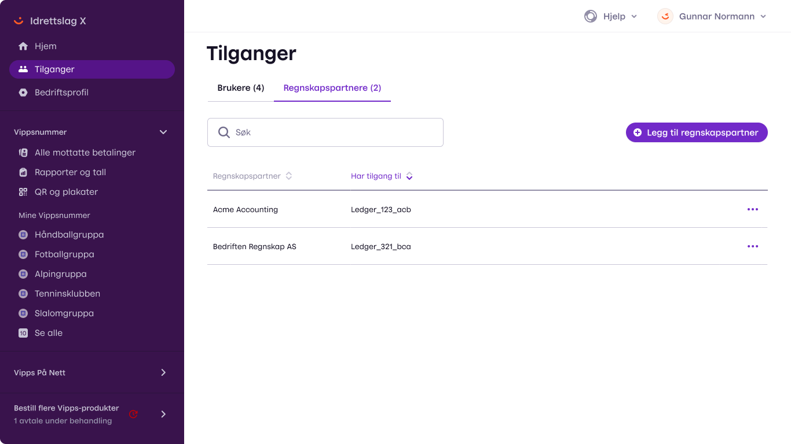

<!-- START_METADATA

title: Vipps settlement concepts
sidebar_position: 5

---

END_METADATA -->

# Vipps Report API

<!-- START_COMMENT -->

ℹ️ Please use the new documentation:
[Vipps Technical Documentation](https://vippsas.github.io/vipps-developer-docs/).

<!-- END_COMMENT -->

<!-- START_TOC -->

# Table of contents

* [Settlements in Vipps](#settlements-in-vipps)
* [Authentication](#authenticatiion)
  * [Using the merchant's API keys](#using-the-merchants-api-keys)
  * [Using the partner's partner keys](#using-the-partners-partner-keys)
* [Ledgers](#ledgers)
    * [Example for eCom/ePayments](#example-for-ecomepayments)
    * [Example for Vippsnummer](#example-for-vippsnummer)
* [Reports](#reports)
  * [Formats](#formats)
    * [JSON](#json)
    * [CSV](#csv)
  * [Periodization](#periodization)
* [Accounting partners](#accounting-partners)
  * [Overview of accounting partners](#overview-of-accounting-partners)
  * [Adding a new accounting partner](#adding-a-new-accounting-partner)
* [Questions?](#questions)

<!-- END_TOC -->

Document version: 0.0.5.

## Settlements in Vipps

Please see the
[Settlement guide](settlement-guide.md)
for an overview of how settlements work in Vipps.

## Authentication

There are two ways to connect to the Report API:
* Using the merchant's own API keys for the sale unit.
* Using the partner's API keys, called
  [partner keys](https://vippsas.github.io/vipps-developer-docs/docs/vipps-partner/#partner-keys).

See:
[Getting started: Get an access token](https://vippsas.github.io/vipps-developer-docs/docs/vipps-developers/vipps-getting-started#get-an-access-token).

### Using the merchant's API keys

Individual merchants that have API keys
for using the eCom/ePayment APIs may use this to access a single
Ledger connected to the sale unit (identified with MSN).

### Using the partner's partner keys

Partner API users do not have access to any ledgers by default. Such
access must be granted by the merchant:
[Adding a new accounting partner](#adding-a-new-accounting-partner).

## Ledgers

See:
[Settlement guide: Ledgers](settlement-guide.md#ledgers).

All ledgers have their own `ledgerId`, so the first step in using the report API is
to fetch the list of ledgers you have access to. This is managed as
described in
[Give access to an accounting partner](#give-access-to-an-accounting-partner).

The ledgers are fetched with
`GET:/report/v1/report/v1/ledgers`.

If you are integrating a single
merchant it may be enough to hit this endpoint once manually to identify
the `ledgerId`.

**Please note:** There is no need to specify the merchant or sale unit.
The response contains all ledgers that are available for the API keys used.

#### Example for eCom/ePayments

```json
{
  "items": [
    {
      "ledgerId": "302321",
      "currency": "NOK",
      "payoutBankAccount": {
        "country": "NO",
        "accountNumber": "86011117947"
      },
      "firstPayout": "2000001",
      "lastPayout": "2000045",
      "owner": {
        "jurisdiction": "NO",
        "id": "987654321"
      },
      "settlesFor": [
        {
          "type": "epayment",
          "msn": "123455"
        }
      ]
    }
  ]
}
```

#### Example for Vippsnummer

A Vippsnummer will have a different `settlesFor` structure:

```json
{
  "settlesFor": [
    {
      "type": "vippsnummer",
      "country": "NO",
      "vippsnummer": "123455"
    }
  ]
}
```

If you only want to look up the `ledgerId` from an MSN or Vippsnummer, you
may use the `msn` or `vippsnummer` arguments to filter the response:
* `GET:/report/v1/report/v1/ledgers?msn=123456`
* `GET:/report/v1/report/v1/ledgers?vippsnummer=123456`

**TODO:** Check these examples. 👆

If you are integrating an accounting system for many customers, it can be
relevant to poll this endpoint many times as you will continue to see new
ledgers appear for different customers as they add you as accounting partner.
See:
[Adding a new accounting partner](#adding-a-new-accounting-partner).

## Reports

See:
[Settlement guide: Reports](settlement-guide.md#reports).

You can, at any time, request a report from a ledger by
calling
[`GET:/report/v1/ledgers/{ledgerId}/transactions`](https://vippsas.github.io/vipps-developer-docs/api/report#/paths/~1v1~1ledgers~1%7BledgerId%7D~1transactions/get)

And also specify the time interval:
[`GET:/report/v1/ledgers/{ledgerId}/transactions?ledgerDate={YYYY-MM-DD}`](https://vippsas.github.io/vipps-developer-docs/api/report#/paths/~1v1~1ledgers~1%7BledgerId%7D~1transactions/get)

You can use the `columns` parameter to specify a comma-separated list of which
data to include in the response. These columns are available (see the API
specification for details):

* transactionId
* transactionType
* reference
* ledgerDate
* ledgerAmount
* grossAmount
* fee
* msn
* time
* price.description

An example combining the options above (line break added for readability):

```
GET:/report/v1/ledgers/302321/transactions?ledgerDate=2022-10-01&columns=
transactionId,transactionType,reference,ledgerDate,ledgerAmount,grossAmount,fee,msn,time,price.description
```

**Please note**: Data is not available in the API until some time after
the `ledgerDate` has ended. This is primarily because Vipps in some
cases compute fees based on the volume throughout the entire day,
so that the `fee` and `ledgerAmount` can not be computed before the day
has ended.

### Formats

The endpoint can return either CSV or JSON depending on the `Accept` header;
both always contain the exactly same data just in different representations.
* CSV: `Accept: text/csv`
* JSON: `Accept: application/json`

#### JSON

When you have retrieved the `ledgerId` with
[`GET:/report/v1/ledgers`](https://vippsas.github.io/vipps-developer-docs/api/report#/paths/~1ledgers/get),
you can get the transactions with
[`GET:/report/v1/ledgers/{ledgerId}/transactions`](https://vippsas.github.io/vipps-developer-docs/api/report#/paths/~1ledgers~1%7BledgerId%7D~1transactions/get)
and get a response similar to this
when using the `Accept: application/json` header:

```json
{
   "transactions":[
      {
         "transactionID":"2000001",
         "timestamp":"2022-09-22T09:31:28+00:00",
         "ledgerDate":"2022-09-22",
         "ledgerID":"1",
         "transactionType":"refund",
         "orderID":"string",
         "ledgerAmount":{
            "value":0,
            "currency":"NOK"
         },
         "grossAmount":{
            "value":0,
            "currency":"NOK"
         },
         "fee":{
            "value":0,
            "currency":"NOK"
         },
         "priceRate":1.25,
         "priceFixed":{
            "value":0,
            "currency":"NOK"
         },
         "storeID":"msn/1234",
         "storeName":"Lokalbutikk Løkka"
      }
   ]
}
```

#### CSV

When you have retrieved the `ledgerId` with
[`GET:/report/v1/ledgers`](https://vippsas.github.io/vipps-developer-docs/api/report#/paths/~1ledgers/get),
you can get the transactions with
[`GET:/report/v1/ledgers/{ledgerId}/transactions`](https://vippsas.github.io/vipps-developer-docs/api/report#/paths/~1ledgers~1%7BledgerId%7D~1transactions/get)
and get a response similar to this
when using the `Accept: text/csv` header:

```
transactionId,transactionType,reference,ledgerDate,ledgerAmount,grossAmount,fee,msn,time,price.description
3343121302,capture,purchase-12,2022-10-01,97.00,100.00,3.00,123455,2022-10-01T10:23:43.422143+02:00,3.00% + 0.00
2342128799,capture,purchase-12,2022-10-01,97.00,100.00,3.00,123455,2022-10-01T11:04:12.234234+02:00,3.00% + 0.00
2442145459,capture,purchase-13,2022-10-01,194.00,200.00,6.00,123455,2022-10-01T13:11:40.234234+02:00,3.00% + 0.00
2049872323,refund,purchase-12,2022-10-01,-100.00,-100.00,0.00,123455,2022-10-01T14:32:17.324342+02:00,3.00% + 0.00
18000302321002000045,payout,2000045,2022-10-01,-288.00,-288.00,0.00,,2022-10-02T00:00:00.000000+02:00,
```

Formatted as a table:

| transactionId        | transactionType | reference   | ledgerDate  | ledgerAmount | grossAmount |  fee | msn    | time                              | price.description |
|----------------------|-----------------|-------------|-------------|-------------:|------------:|-----:|--------|-----------------------------------|--------------|
| 3343121302           | capture         | purchase-12 | 2022-10-01  |        97.00 |      100.00 | 3.00 | 123455 | 2022-10-01T10:23:43.422143+02:00 | 3.00% + 0.00 |
| 2342128799           | capture         | purchase-12 | 2022-10-01  |        97.00 |      100.00 | 3.00 | 123455 | 2022-10-01T11:04:12.234234+02:00 | 3.00% + 0.00 |
| 2442145459           | capture         | purchase-13 | 2022-10-01  |       194.00 |      200.00 | 3.00 | 123455 | 2022-10-01T13:11:40.234234+02:00 | 3.00% + 0.00 |
| 2049872323           | refund          | purchase-12 | 2022-10-01  |      -100.00 |     -100.00 | 3.00 | 123455 | 2022-10-01T14:32:17.324342+02:00 |              |
| 18000302321002000045 | payout          | 2000045     | 2022-10-01  |      -288.00 |     -288.00 | 0.00 |        | 2022-10-02T00:00:00.000000+02:00 |              |


For more details about individual columns available, please see the API specification.

### Periodization

See:
[Settlement guide: Periodization](settlement-guide.md#periodization).

The
[`GET:/report/v1/ledgers/{ledgerId}/transactions`](https://vippsas.github.io/vipps-developer-docs/api/report#/paths/~1v1~1ledgers~1%7BledgerId%7D~1transactions/get)
endpoint has several parameters for selecting a range of
transactions to return, which can be used for an initial data import.

Most users of the API will want to set up an automated job to call
[`GET:/report/v1/ledgers/{ledgerId}/transactions`](https://vippsas.github.io/vipps-developer-docs/api/report#/paths/~1v1~1ledgers~1%7BledgerId%7D~1transactions/get)
on a daily basis to download the data for the
preceding day.

## Accounting partners

The Report APP can be used by the merchant itself, and by the merchant's
accounting partner.

Merchants must give access to their accounting partner on
[portal.vipps.no](https://portal.vipps.no).

### Overview of accounting partners

A merchant may have zero or more accounting partners. This page on
[portal.vipps.no](https://portal.vipps.no)
shows the accounting partners for one sale unit.



### Adding a new accounting partner

This page on
[portal.vipps.no](https://portal.vipps.no)
shows how to add an accounting partners, and how to specify which ledgers the
accounting partner will have access to.


## Questions?

We're always happy to help with code or other questions you might have!
Please create an [issue](https://github.com/vippsas/vipps-ecom-api/issues),
a [pull request](https://github.com/vippsas/vipps-ecom-api/pulls),
or [contact us](https://github.com/vippsas/vipps-developers/blob/master/contact.md).

Sign up for our [Technical newsletter for developers](https://github.com/vippsas/vipps-developers/tree/master/newsletters).
